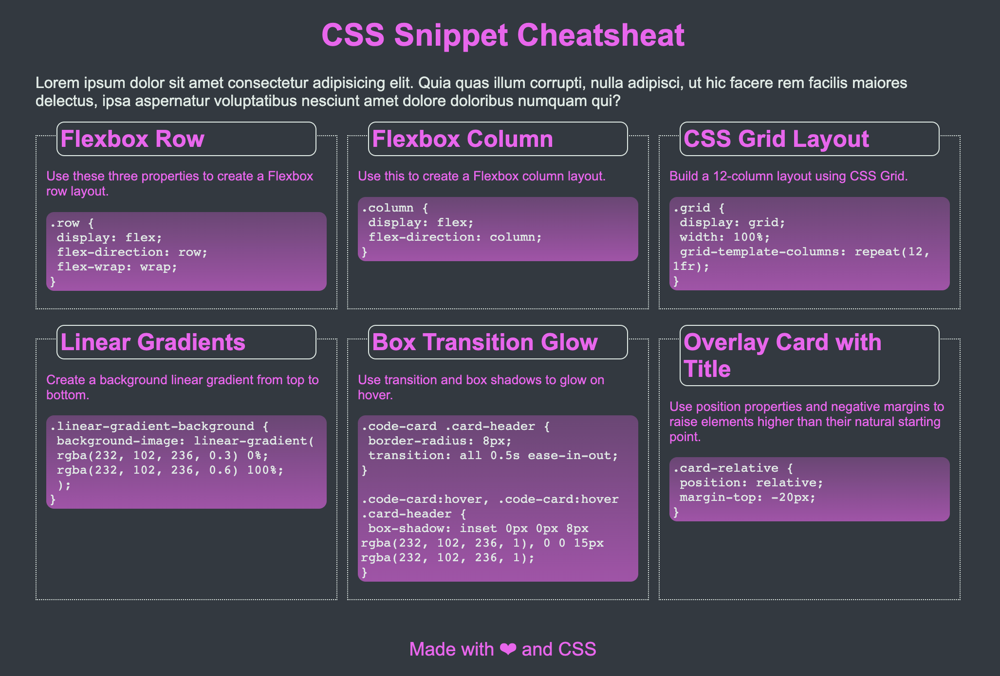

# Advanced CSS Portfolio
## About the project
Homework assignment of the ESMT Coding Boot Camp focused on learning advanced CSS.

## Screenshot

## Changelog
* Create index.html information architecture
* Fill in page content of headers, paragraphs, code boxes, and footer
* Set stylesheet flex layout 
* Create root variables for color and font
* Set content page content flow (column) and main/central content flow (row)
* Style cards and code boxes
* Struggle mightily with emoji color and fail repeatedly
* Pull hair over code box height and curse the dawn
* Move on
## Contact
Tammi L. Coles   
Project link: https://github.com/tlcoles/mini-project  
Working copy: https://tlcoles.github.io/mini-project/  